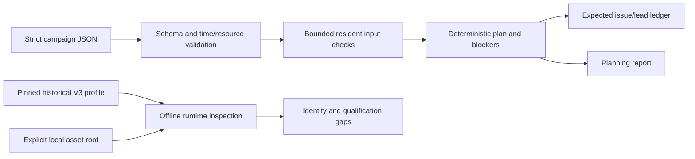
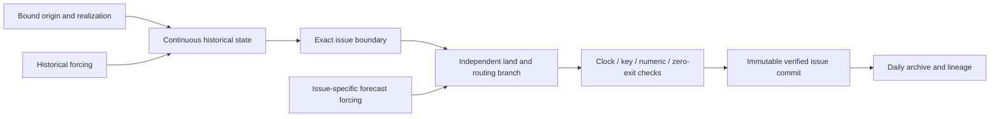
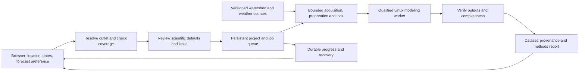

# Architecture and implementation boundary

The first increment contains an offline control plane. Campaign planning and runtime inspection are independently testable and do not import the historical research implementation.

`campaign.py` owns parsing, campaign contracts, bounded local asset identity checks and expected output keys. `runtime.py` owns the exact historical profile and its source/build/fixture closure inspection. `cli.py` owns command dispatch, structured errors, row bounds and atomic publication of new output files. The Python package has no third-party runtime dependencies and does not activate containers or network clients.

A specification identity hashes the canonical declared configuration. A plan identity hashes the observed planning result, so changing input availability or disabling asset checks produces a different plan. Domain input identities record declared scientific inputs; they are not serialized physical state or proof that those files contain the required forcing interval. Missing identities remain explicit.

## Future physical integration

The historical adapter must be extracted and qualified before `run` or `resume` can be implemented. Its contract is:

The parent continues under historical forcing only after isolation is acknowledged. Each child owns its input file descriptions, router and output writers. No child-to-parent state edge is permitted. New River's two nested gauge outputs are products of one domain trajectory. A source key, a matching clock and a routing q0 snapshot do not establish a complete portable land-state checkpoint.

Recovery reconstructs history from the same original origin and bound assets and suppresses only forecast issues with valid existing commits. It cannot silently shorten the historical interval, substitute missing meteorology or restore land state from discharge outputs. The existing replay helper and historical receipts motivate this design; fresh public-package replay tests are still required.

The manuscript analyzes these choices and their measured consequences. The generated campaign report describes one plan or, after execution is implemented, one specific run. Neither replaces the user/developer documentation or numerical qualification evidence.

## Planned hosted researcher experience — 23 September 2026

The [product objectives and user journeys](PRODUCT_OBJECTIVES_AND_USER_JOURNEYS.md) make the browser the primary researcher interface. The existing offline core and future qualified physical engine sit beneath that interface. The following service components are planned; no hosted application, network preparation service or modeling worker has been deployed by this planning update.

The service translates a small researcher request into the same versioned scientific contracts used by the engine; browser code must not independently reinterpret clocks, scientific defaults or provenance. Source adapters handle supported identifier mappings and actual historical/forecast coverage, including initialization and final targets. Continuous simulation needs an explicit mode-specific schema; the current `hourly18h` parser is not already that interface.

Long jobs run independently of browser sessions. Access control, job identity, duplicate-request handling, isolated workers, resource bounds, durable events, verified exports and storage/retention policies are explicit service responsibilities in proposed WEB-01–WEB-07. Automatic acquisition is a planned, disclosed part of a bounded service submission; it does not change the offline commands' no-network behavior or authorize access to protected research folders.

The hosting vendor, web framework, service database/queue, account system and funding model are open design choices. A graphical prototype demonstrates interaction only. The [UX evaluation protocol](UX_EVALUATION_PROTOCOL.md) separates that evidence from real execution, numerical qualification and independent scientific reproduction.
